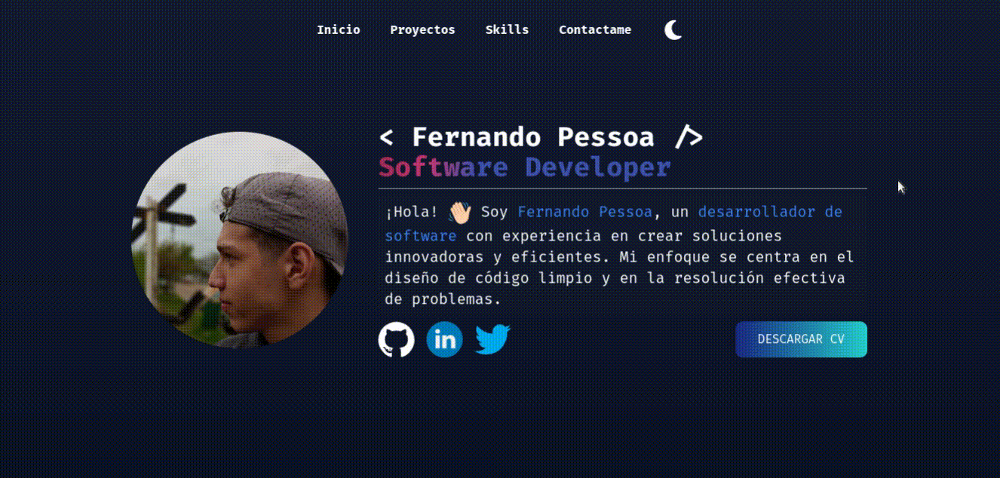
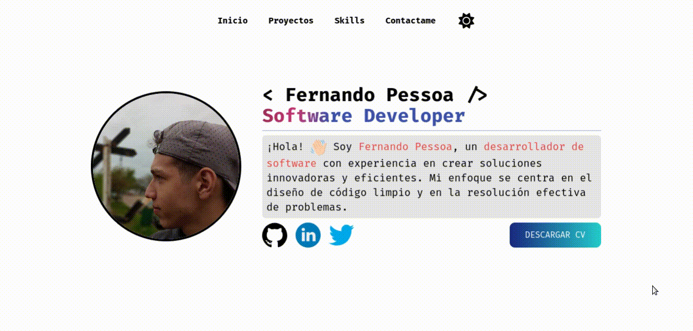

# Porfolio

My porfolio with Astro, preact and tailwindcss

<div align="center">
   <a href="https://skillicons.dev">
    
  </a>
</div>

## Dark theme



## Light theme



# Development setup

First, clone the repo and cd into the project

```bash
git clone https://github.com/Ferchupessoadev/porfolio
cd porfolio
```

# Local setup

install dependencies:

```bash
npm install
```

# Run project in to local server

```bash
npm run dev
```
